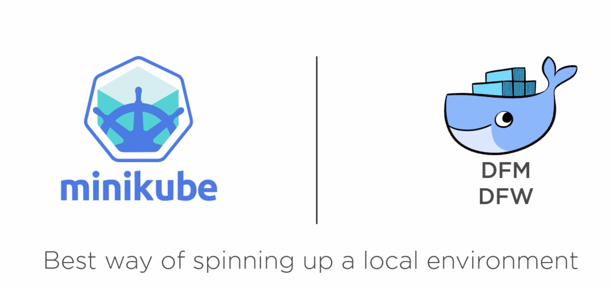
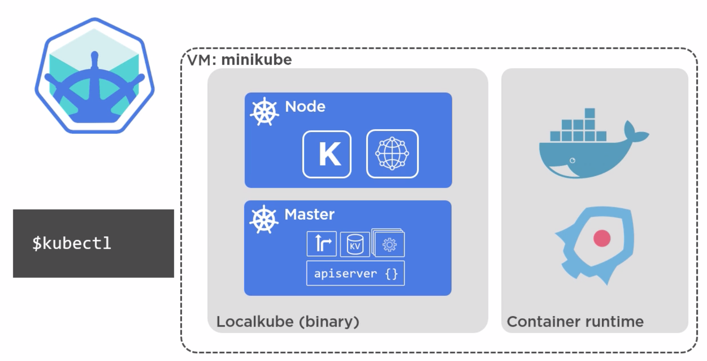
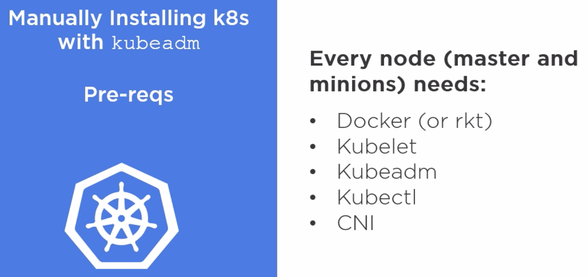

# Installing Kubernetes
- On public cloud
- On premises
- On local laptop

# Minikube
- Installing on local laptop

- Architecture of Minikube

- It needs virtualization extension enable in system bios, therefore we cannot use `Minikube` on public cloud.
## Installation Steps
- `brew install kubectl` It puts `kubectl` binary in `/usr/bin` and make it accessible.
- Check version after installation `kubectl version --client`
- To install minikube `brew cask install minikube`
- To install xhive hypervisor `brew install docker-machine-driver-xhyve`
- This driver requires superuser privileges to access the hypervisor. To enable, execute 
```
sudo chown root:wheel /usr/local/opt/docker-machine-driver-xhyve/bin/docker-machine-driver-xhyve
sudo chmod u+s /usr/local/opt/docker-machine-driver-xhyve/bin/docker-machine-driver-xhyve
```
- Start `minikube` by running following command
```
minikube start --vm-driver=xhyve
```
- Start hello world container 
```
kubectl run hello-minikube --image=k8s.gcr.io/echoserver:1.10 --port=8080
```
- Expose hello world service 
```
kubectl expose deployment hello-minikube --type=NodePort
```
- To check health of `pod`
```
kubectl get pod
```
- To test hello world
```
curl $(minikube service hello-minikube --url)
```
- Delete service 
```
kubectl delete services hello-minikube
```
- Delete deployment
```
kubectl delete deployment hello-minikube
```
- Stop `minikube`
```
minikube stop
```
- Start minikube dashboard
```
minikube dashboard
```
# Google Kontainer Engine (GKE)
- Make a note here, its `Kontainer`, not `Container`
- Google container engine is Kubernetes
- Google Kontainer Engine is layered upon Google Computing Engine (GCE). 

# Kops binary
# Manually installing Kubernetes


## kubeadm
